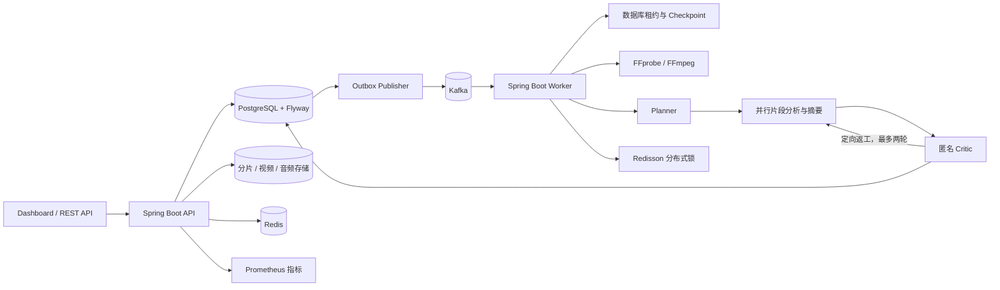

# Long Video Agent Harness

面向长视频内容理解的异步处理服务。系统将媒体接入、音频解析、转写片段编排、内容分析、摘要生成与独立审校组织为可恢复的任务流程，为每条关键结论保留时间范围和原文证据。

项目采用 Java 17 和 Spring Boot 构建，使用 PostgreSQL 管理任务状态与运行记录，Kafka 承载异步任务事件，Redis 提供上传状态与并发协调能力。服务提供 REST API、Web Dashboard 和 Prometheus 指标端点，可按需接入 OpenAI-compatible 模型服务。

## 能力概览

- **媒体接入：** 支持分片上传、断点续传、SHA-256 完整性校验和内容哈希去重。默认分片大小为 8 MiB，单文件上限为 2 GiB；媒体信息解析和音频提取由 FFprobe、FFmpeg 处理。
- **异步任务编排：** 通过 PostgreSQL Outbox 发布 Kafka 任务事件。Worker 使用数据库租约领取任务，以节点尝试记录和 Checkpoint 支持幂等消费、失败重试和断点续跑。
- **多 Agent 内容分析：** Planner 根据媒体时长和转写规模划分片段，分析节点并行处理，生成带来源片段、时间范围和原文证据的结构化事实。Critic 在不接收 Agent 身份信息的情况下复核事实一致性与关键信息覆盖，并可发起最多两轮定向返工。
- **运行治理：** 为运行和节点设置调用、Token 与时间预算；支持超时、指数退避、协作式取消、失败续跑、Checkpoint 和 Run Trace。
- **反馈与版本演进：** 结构化记录用户反馈并按规则指纹聚合。Prompt/Skill 候选需依次通过 Validation 和 Holdout 门禁，符合质量约束后才会激活，并保留版本审计与回滚能力。
- **运行观测：** Dashboard 展示任务、DAG 节点、分段证据、摘要、Critic 结论、预算和 Trace；`/actuator/prometheus` 提供服务指标。

## 架构



单次运行的主要阶段如下：

```text
媒体解析 → 音频提取 → 转写加载 → 规划 → 并行片段分析 → 摘要聚合
                                                     ↓
完成 ← 结果校验 ← 最多两轮定向返工 ← 匿名 Critic 复核
```

Outbox 将业务状态更新与待发布事件写入同一数据库事务。Worker 通过数据库原子租约获取运行权；Kafka 重投时，已完成节点由 Checkpoint 跳过。节点预算在数据库事务中预留和结算，租约在执行期间续期。取消采用协作式语义，已经完成的运行不会被取消状态覆盖。

## 部署

需要 Docker Compose v2。启动 API、Worker、PostgreSQL、Redis、Kafka 和 Prometheus：

```bash
docker compose up -d --build
```

服务地址：

| 服务 | 地址 |
| --- | --- |
| Web Dashboard | `http://localhost:8080/` |
| 健康状态 | `http://localhost:8080/actuator/health` |
| Prometheus 指标 | `http://localhost:8080/actuator/prometheus` |
| Prometheus 控制台 | `http://localhost:9090/` |

查看服务日志：

```bash
docker compose logs -f api worker
```

停止服务并保留持久化数据：

```bash
docker compose down
```

## 处理流程与接口

调用方先上传视频，再提交与视频对应的转写片段，然后创建异步运行。转写片段包含稳定 ID、起止时间和文本；生成的事实和摘要都会引用这些片段。

| 接口 | 说明 |
| --- | --- |
| `POST /api/v1/uploads` | 创建分片上传会话 |
| `PUT /api/v1/uploads/{id}/chunks/{index}` | 提交分片，使用 `X-Chunk-SHA256` 校验分片内容 |
| `GET /api/v1/uploads/{id}` | 查询上传会话及已接收分片 |
| `POST /api/v1/uploads/{id}/complete` | 校验整文件摘要并完成合并 |
| `POST /api/v1/videos/{id}/transcript` | 关联转写片段 |
| `POST /api/v1/runs` | 创建异步内容理解运行 |
| `GET /api/v1/runs/{id}` | 查询状态、报告、预算、节点和 Trace |
| `GET /api/v1/runs/{id}/events` | 通过 SSE 获取增量 Trace 事件 |
| `POST /api/v1/runs/{id}/cancel` | 请求协作式取消 |
| `POST /api/v1/runs/{id}/resume` | 续跑失败任务，可提交预算上调 |
| `POST /api/v1/runs/{id}/feedback` | 提交结构化反馈 |
| `POST /api/v1/benchmark` | 评估当前内容理解 Provider |
| `/api/v1/evolution/*` | 查看反馈模式、评估候选版本和回滚 |

分片清单以 PostgreSQL 为准，Redis 保存可恢复的上传进度缓存，文件字节写入共享存储目录。当前默认配置限制上传速率为每秒 20 个分片、突发 40 个请求。浏览器内置入口面向小型文件；较大文件应由客户端分块并采用流式方式计算整文件 SHA-256。

## Agent、Provider 与工具权限

系统默认使用确定性 Mock Provider，便于在没有外部模型凭据时运行相同的任务流程。Mock Provider 只基于提交的转写片段生成结构化分析，不从音轨推断或伪造语音识别结果。

可通过 OpenAI-compatible Chat Completions 接口替换内容 Provider：

| 环境变量 | 说明 |
| --- | --- |
| `HARNESS_PROVIDER` | Provider 模式：`mock` 或 `openai` |
| `HARNESS_MODEL_URL` | 完整 Chat Completions URL |
| `HARNESS_MODEL_NAME` | 模型名称 |
| `HARNESS_MODEL_KEY` | API Key |

`ToolRegistry` 采用按 Agent 配置的只读工具白名单，拒绝未授权工具调用。MCP 目前提供权限适配接口，尚未包含远程 MCP Server transport。

## 评测与演进

基准数据位于 [`src/main/resources/benchmark/long_transcripts.json`](src/main/resources/benchmark/long_transcripts.json)，包含 20 条长转写样本，固定划分为 12 条 Validation 和 8 条 Holdout。评测器执行当前 Provider 并统计事实一致性、关键信息召回、摘要完整性、任务成功率、平均耗时及预算估算。

演进候选先与当前活跃版本比较 Validation 指标。四项质量指标均不退化且至少一项提升时，才继续评估 Holdout；Holdout 同样满足门禁后自动激活。候选配置会影响 Mock 的事实提取范围和模型提示词；版本、评测结果、门禁决策及前驱版本均保存在 PostgreSQL。回滚恢复前一个活跃版本，不修改程序源码。

## 配置与运行边界

默认 Docker Compose 配置启用 PostgreSQL、Redis、Kafka、媒体解析和 Worker。核心配置也可通过环境变量调整：

| 环境变量 | 默认值 / 用途 |
| --- | --- |
| `DATABASE_URL` | Compose 使用 PostgreSQL；本地默认使用 H2 文件数据库 |
| `DATABASE_USERNAME` / `DATABASE_PASSWORD` | 数据库凭据 |
| `KAFKA_BOOTSTRAP_SERVERS` | Kafka Broker 地址 |
| `HARNESS_REDIS_URL` | Redis 地址 |
| `HARNESS_STORAGE_ROOT` | 视频、音频及分片存储目录 |
| `HARNESS_MEDIA_ENABLED` | 启用 FFprobe/FFmpeg 媒体处理 |
| `HARNESS_WORKER_ENABLED` | 启用 Kafka Worker |

转写文本由调用方提交；当前未集成 ASR。默认 Provider 为 Mock，Mock 评测指标用于比较仓库内固定样本，不代表真实模型或生产流量效果。上传上限为 2 GiB 的配置值，不等同于已完成 GB 级性能验证。片段分析在单个 Worker 内最多 4 路并行。服务按单租户部署设计，当前不含用户认证、多租户隔离或高可用配置；部署到可信网络之外时，应先在入口配置鉴权和访问控制。
